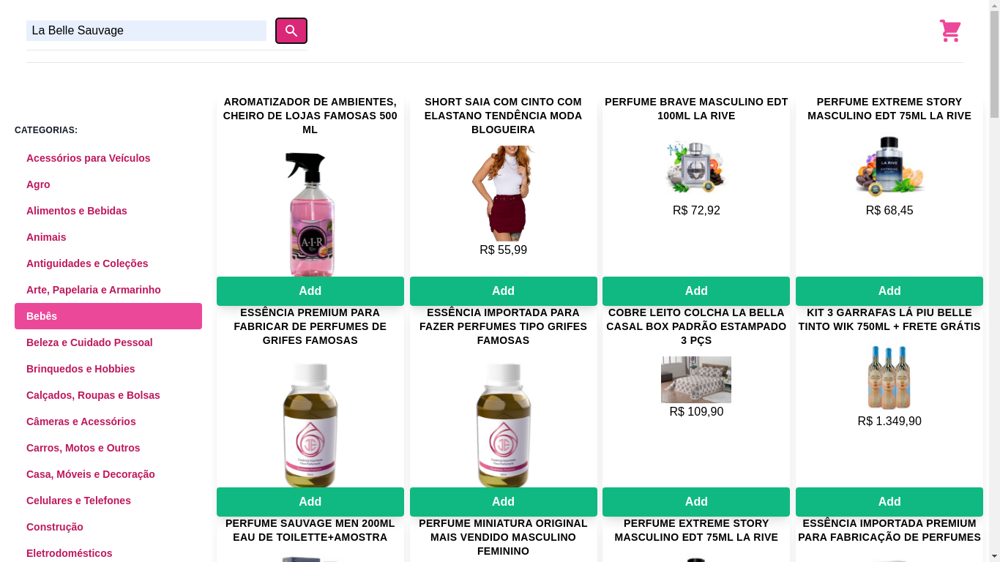

# Trybe Project Frontend Online Store 23/09/2021
 

  
  
  

 

## Habilidades

- Entender o que são Métodos Ágeis;
- Entender o que é Kanban;
- Entender o que é Scrum;
- Trabalhar em equipes utilizando Kanban ou Scrum de maneira eficaz;
- Praticar todas as habilidades desenvolvidas até agora no módulo de Front-End.

## Desenvolvimento
Uma versão simplificada, sem persistência no banco de dados, de uma [loja online](https://weltonthomasferreira.github.io/trybe-project-frontend-online-store/).

## Resultados

- Projeto em grupo;
- `4` dias de projeto;
- `15` requisitos;
- Percentual de cumprimento de requisitos obrigatórios `83.33%`;
- Percentual de cumprimento de requisitos totais `66.67%`.
